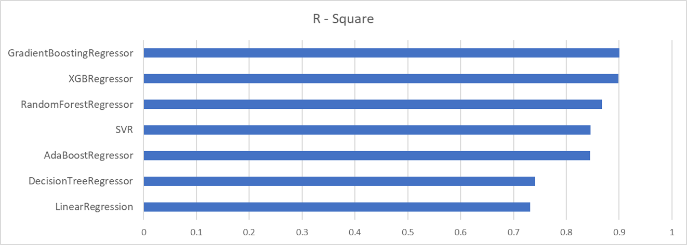

# House-Price-Prediction
The objecive of this project is to predict house price from different features.

# Data Set Info: 
Check train.csv 
Number of Instances: 1460 
Number of Features: 80 

# Applied Algorithms:
Linear Regression 
Decision Tree 
SVM 
Random Forest 
AdaBoost 
GradientBoost 
XGBoost 

# Feature Engineering
 

# Performace:
Check performance.csv for details. 

# Scripts:
Check housePricePredict.py
